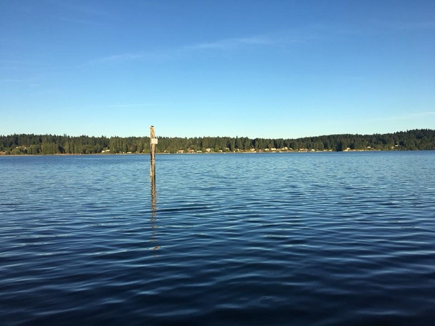
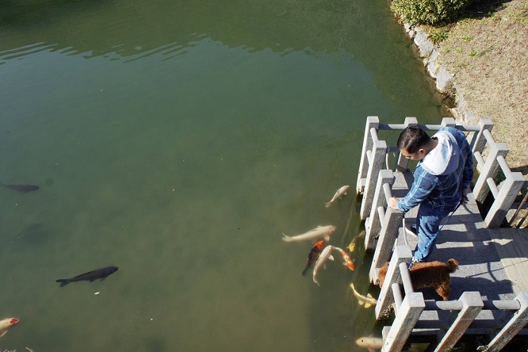

# An island girl 

#### Born and raised on the beautiful island of Guam.  In 2008 I set some new roots in the beautiful Pacific North West -- Bremerton, Washington.  Since then I have met and married my husband, lived up my youthful years in San Diego, and now I am making the most of living in a foreign country with an addition to my family (Kuni the pup) -- Iwakuni, Japan.

---

##### It's a hard tie between Guam's beaches & the food as one of the best things on island!

##### Yes, it may get gloomy in the PNW. However, the summers are amazingly beautiful!

##### From late night cali burrito runs to early hikes, San digeo is by far a great place to live!

##### Japan spoils us with the numerous vending machines to its cheap food, but I'm not complaining!

---

# Aside from traveling

#### I have a few goals I have set for myself:
1. Become a certified ***Sign language interpreter***
2. Start a *family* of my own
3. Size down to a *minimalist lifestyle*
4. ***Live my life to its fullest***

---

[Back to home](index)
