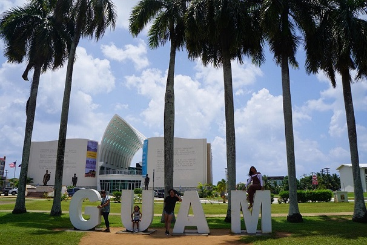
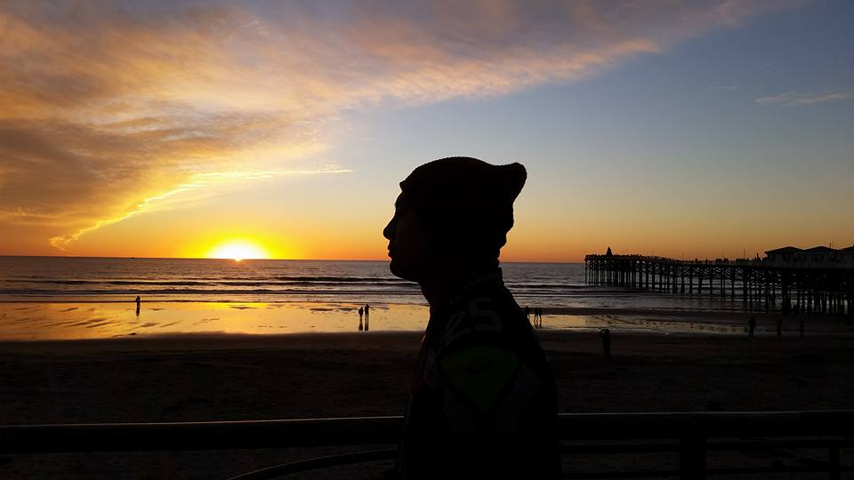
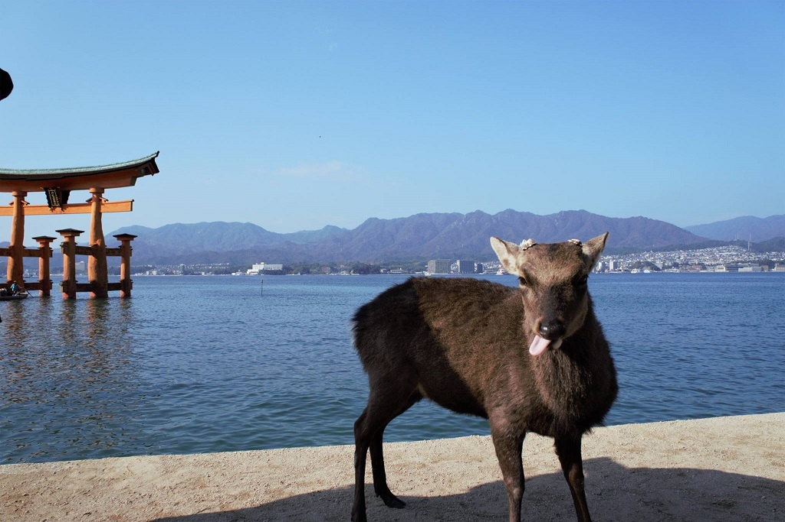

# An island girl 

Born and raised on the beautiful island of Guam.  In 2008 I set some new roots in the beautiful Pacific North West -- Bremerton, Washington.  Since then I have met and married my husband, lived up my youthful years in San Diego, and now I am making the most of living in a foreign country with an addition to my family (Kuni the pup) -- Iwakuni, Japan.

[Back to home](index)
