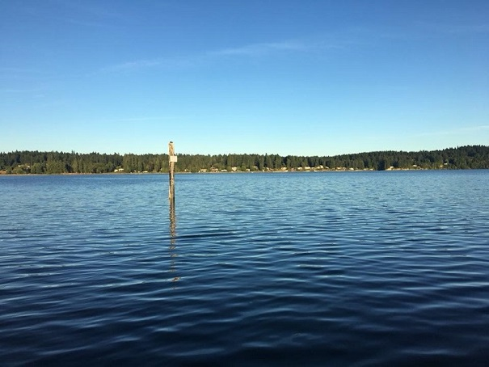
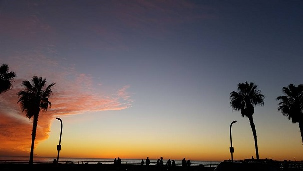

# An island girl 

#### Born and raised on the beautiful island of Guam.  In 2008 I set some new roots in the beautiful Pacific North West -- Bremerton, Washington.  Since then I have met and married my husband, lived up my youthful years in San Diego, and now I am making the most of living in a foreign country with an addition to my family (Kuni the pup) -- Iwakuni, Japan.

---

##### It's a hard tie between Guam's beaches and the food as one of the best thing about the island!

##### Yes, it may get gloomy in the PNW. However, the summers are amazingly beautiful!

##### From late night cali burrito runs to early hikes, San digeo is by far a great place to live in your early 20's!

##### Japan has been quite the journey, but luckily there's a quick train ride to different destinations!

[Back to home](index)
