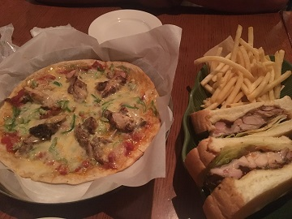

# IWAKUNI EATS
---

##### I am actually quite embarrassed that I can have a specific section for food.  What can I say, I *love* to eat!  Learning of new *retsutoran* (restaurants) to try happened either through word of mouth or just exploring the the corners of Iwakuni.  There is still so much to explore within this little *machi* (town), but that is a challenge I am willing to accept.

### Tips when dining out:
##### 1. Carry **yen** at **all times**!  You can withdraw yen from ATMs at either 7-11s, Post Offices, and local grocery stores.
##### 2. Ask for an **Eigo** (English) menu!  However, it's not guaranteed they'll always have one. 
##### 3. Say **Sumimasusen** to get the employee's attention if there's no button to press when you're ready to order.
##### 4. When finished ordering, say **Igo desu**, it means *that's all*.
##### 5. If you need the bill *split*, say **Betsu betsu, onegaishimasu** (split please). 

---

### ***COCO ICHIBANYA***
##### Address: 1 Chome-16-17 Minamiiwakunimachi, Iwakuni, Yamaguchi Prefecture 740-0034 near Youme Town.  
##### Address: 1 Chome-3-14 Marifumachi, Iwakuni, Yamaguchi Prefecture 740-0018 near Iwakuni *Eki* (train station).
##### Hours: Open every day: 1100 - 0000
##### ***JAPANESE CURRY!***  For some this restuarant is overrated, however for the price and amount of food, this restaurant will always be one of my quick go to.  My favorite dish is either the **crispy chicken** or the **chicken katsu** with cheese and spice level 3.  Be careful when choosing the level of spiceness, because depending on who is the cook of the day --the spice level can vary.  Level 10 is the highest, if you were to reach this level, props to you!  *If you're not feeling too hungry, get the **half order** of your usual --150g of rice,curry, and a drink on the side!* **Eigo (English) menu is avialable and either yen or debit card is acceptable**

---

### ***KINBA***
##### Address: 1 Chome-10-17 Imazumachi, Iwakuni, Yamaguchi Prefecture 740-001  (park across the street in ticketed parking lot)
##### Hours: Sunday - Saturday 1100 - 1430 *&* 1700 - 2300.  *Closed on Tuesdays*!
##### ***OKONOMIYAKI (japanese pancake)!***  If you like to have a show before digging into your food, this place is up your alley.  I'm not talking about a circus show, but rather the cooks smoothing out the batter, making the egg golden brown, stacking ingredients on top of each other, and the best part --having to flip everything all together!  This dish can either be indulged by one person or can be shared between two.  The atmosphere in the restaurant is unique with a book shelf stacked with manga (Japanese anime) for the customers to read.  Hang out, watch the show, and don't forget to order a drink with tapioca!  **Eigo (English) menu is avialable and either yen or debit card is acceptable**

---

### ***YAMABIKO***
##### Address: 1 Chome-5-22 Muronokimachi, Iwakuni, Yamaguchi Prefecture 740-0021
##### Hours: Open every day 1100 - 2200  (*When dining, take note of their calendar on the door, they may have a personal day off*).
##### ***RAMEN!*** Tonkatsu ramen is more on the rich, thick, and creamy side of the ramen choices.  This restuarant is simple, which is what ramen should be.  The menu consists of 6 different types of ramen dishes, but it really varies between what toppings are in the ramen.  Other side dishes that go perfect with the ramen are *chahan (fried rice), gyoza, and *karaage* (fried chicken).  Don't forget to ask for a stamp card, because you'll find yourself coming back for more!  **Eigo (English) menu is avialable and yen is only acceptable**

---

### ***VEGE TRIP***
##### Address: Iwakuni City Marketplace 5 Chome, 11-1, Ozumachi, Iwakuni City, Yamaguchi Prefecture
##### Hours: Weekdays 0700 - 1600.  Weekends 1000 - 1600.
##### ***SMOOTHIES!***  Vege trip is in an odd location, don't worry you're not the only one to think this.  You'll have to drive through the Iwakuni Lotus fields before finding this petite vibrant stand.  Order a freshly juiced beverage, or a cute fruit stacked smoothie, or my favorite --their pizza.  Everything on the menu is light and perfect for a small lunch or a sweet tooth craving.  Relax inside while admiring the chic interior design Vege Trip has to offer.  Don't forget to take a picture and tag them in it!  **Eigo (English) menu is available and either debit or yen is acceptable**

---

### ***VITAL YAWD***
##### Address:  2 Chome-2-2 Marifumachi, Iwakuni, Yamaguchi Prefecture 740-0018 (park in ticketed parking lots)
##### Hours: Open every day 1800 - 0100
##### ***JAMAICAN CUISINE!***  Vital Yawd has an ambience of chilling in the backyard on a perfect night.  Upon entering, you'll be greeted with a warm welcome.  Choose a seat -either at the bar, high top tables, or the long family style tables.  You have a variety of menu items; sandwiches, rice dishes, and pizza.  My favorite go to is their jerk chicken sandwich, jerk chicken pizza, and of course the coconut icecream!  The food portion is great for splitting with someone, that way you'll have room for dessert that you wouldn't want to skip out on.  Don't forget to check out their posters for live music!  **Eigo (English) menu is available and either debit or yen is acceptable**
  

---

### ***Very Berry Soup***
##### Address: 3 Chome-18-41 Muronokimachi, Iwakuni, Yamaguchi Prefecture 740-0021
##### Hours: Sunday - Saturday 1100 - 1500. *Closed on Mondays*!
##### ***SWEET & SALTY!***  If you are craving for either a crepe filled with toppings or a soup paired with a salad, you have come to the right place.  If none of those dishes are what you're looking for, Very Berry Soup has a handful of drink options too.  The seating inside is very cozy and a perfect place to dine in and do some studying or homework.  My favorite dish is their french onion soup, paired with fresh baked bread, a salad, and a drink!  For the price Very Berry Soup has to offer, you may find yourself returning more than once. 

---

[Go back](topic)

[Back to home](index)
