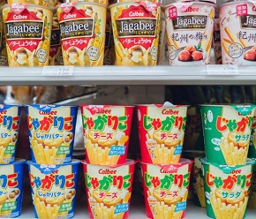
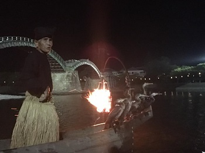
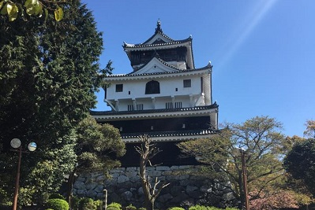

# YAMAGUCHI PREFECTURE 
---

### IWAKUNI

##### Iwakuni is home for my husband and I as well as over 100,000 other residents.  The town has many unique sights and activities to endulge in.  
##### From **konbinis** (convenient stores) to large shopping malls, you can find something that you may not need, but you must buy because it's either *kawaii* (cute) or just one of a kind.  Konbinis are a perfect one quick stop for either a snack, a drink, an ATM, or even house slippers.  7-11s are my favorite go to for seasonal icecream and their *'american dog'* (corn dog), plus they take either yen, debit cards, or even the Suica or ICCOCA card!
   

##### The infamous **Kintaikyo** is not over rated, in my opinion.  With every visit to the park, I can never get tired of the mountains, landscaping, the sound of the river's current, and you can't forget the icecream stands!  Kintaikyo is a year round trip that I like to make, just to get out of the house and enjoy the outdoors.  The park is huge enough to grab some lawn chairs or a blanket and have a picnic with the family while the kids run around or the dogs chilling by your side.  Afterwards, visit one of the icecream stands for some dessert.  My favorite flavor is the *milktea*, then following is *wasabi and grape + lychee*.  Don't forget to ask for an ***EIGO*** (english) menu!  With the different seasons, Kintaikyo is an iconic spot for the Sakura (cherry blossoms) flowers , changing colors of the Momiji (maple) leaves, and the town's hanabi (fireworks) festival.  Other festivites that take place at the Kintaikyo is the welcoming of the New Year's sunrise up at the Iwakuni castle --trust me, it's something worth waking up for and experiencing-- but don't forget to layer up becuase it's super cold.  If the cold doesn't suit the family or yourself, a fun summer activity is the **Ukai** (cormorant fishing) boat ride.  This activity can be done either day or night, but I prefer at night when the temperatures are much cooler and the sky is lit.  During the boat ride you'll see how the cormorant birds are trained to fish for their master, it's quite a sight of how trained they are.  So grab some snacks at the konbinis and reserve your seat on a boat with the family or some friends!
 
     
##### If you were to either make the trek up or take the cable cart to visit the Iwakuni castle, it is a perfect oppotunity for a history lesson.  The architecture that is behind the making of the castle and bridge is phenomenonal.  Also, the tour inside the castle showcases the past years of uniforms, weapons, dishware, transportation, and more of the Emperor and the town's history. There is a small fee for both the cable cart and castle entrance.  Don't let the fees stop you from exploring though!  From the Iwakuni castle you can view the Kintaikyo, the town, and the Nishiki river and you can either take a picture or enjoy the view just for yourself. 
  

 
---
[Back to home](index)

